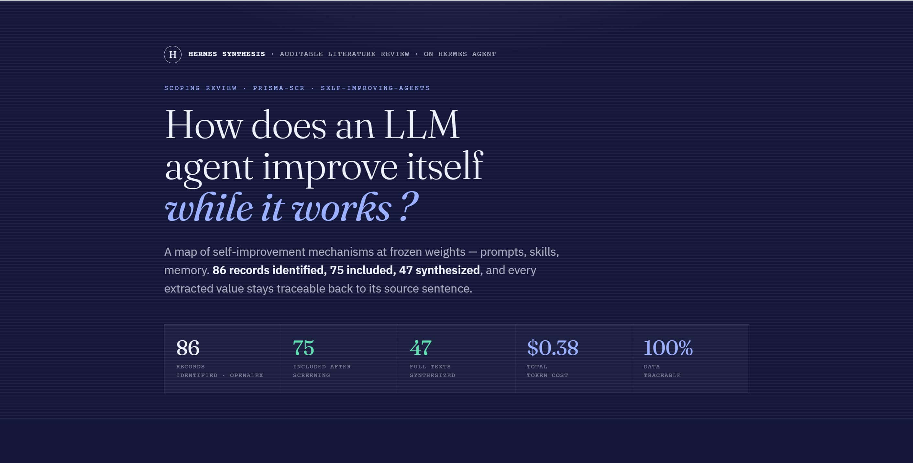

# Hermes Synthesis

**A self-hosted, open-source, auditable literature-review agent for researchers.**



Hermes Synthesis runs a complete systematic/scoping review pipeline — from research question to a PRISMA flow diagram and a bibliography export — on your own machine. Every decision it makes is logged. Every extracted fact is traceable to a verbatim quote in the source. Nothing leaves your environment except the API calls to the model you choose.

I'm building it in the open. It works end-to-end today, but it's early and honest about its limits. Read the [Status](#status) section before you trust it with anything important.

---

## What you need to run this

This is built for **power users** — researchers comfortable with a terminal, Docker, environment variables, and an API key. It's self-hosted and takes some setup — it's not plug-and-play yet.

**To run a review:**
- Docker, plus a running [Hermes Agent](https://github.com/NousResearch/hermes-agent) instance (the orchestrator)
- An OpenAI-compatible LLM endpoint and API key (`LLM_API_ENDPOINT`, `LLM_API_KEY`, `LLM_SCREENING_MODEL`) — I use DeepSeek; a full review costs roughly $0.30–1 in tokens
- An OpenAlex API key (`OPENALEX_API_KEY`) — required since February 2026
- A Python venv with `pymupdf4llm` for full-text PDF parsing:
  ```bash
  uv venv ~/.hermes/venvs/hermes-synthesis
  uv pip install pymupdf4llm --python ~/.hermes/venvs/hermes-synthesis/bin/python
  ```

**For the second-brain / companion layer (optional):**
- An Obsidian vault, symlinked to `/reviews`, if you want every report and decision log to land directly in a vault you own

> Detailed setup instructions are coming as the project stabilizes. If you're trying it early and get stuck, open an issue — your questions will shape the docs.

---

## Why this exists

I built this to help my partner with her PhD. She needed to run rigorous literature reviews, and the closed research assistants out there work by *session*: you ask a question, they answer, and nothing you accumulate persists or belongs to you. I wanted the opposite — a tool where every review is reproducible, every decision is auditable, and the knowledge builds up in a vault the researcher owns.

I'm not a professional developer. I build things with AI because it lets me make tools I could never have made otherwise. This project is one of them. If it's useful to other researchers, wonderful. That's the whole goal.

What pushed me down the rabbit hole was **[Hermes Agent](https://github.com/NousResearch/hermes-agent) from Nous Research**. Their work is genuinely extraordinary, and it's what made a project like this feel possible for someone like me. And I have to be honest about another trigger: **[DeepSeek](https://github.com/deepseek-ai)**. Their token pricing is so low — and keeps dropping — that I could experiment freely, break things, and rerun reviews without ever worrying about cost. I'm not sure I'd have explored half as much without it.

---

## What it does

A review runs as a pipeline of small, independent, testable steps:

```
protocol → search → dedup → screen → (human review) → fulltext → extract → report
```

- **protocol** — captures your research question, inclusion/exclusion criteria, and extraction codebook.
- **search** — queries scholarly databases and records full provenance (source, exact query, date) for every record.
- **dedup** — merges duplicates (exact DOI + fuzzy title matching).
- **screen** — scores each article against your criteria; confident cases are decided automatically, ambiguous ones are queued for you.
- **human review** — you decide the ambiguous cases. The AI proposes; you dispose.
- **fulltext** — retrieves and parses PDFs (open-access URLs + a dropzone for papers you obtained through institutional access).
- **extract** — pulls data according to your codebook using a two-pass anti-hallucination method (verbatim evidence first, then bounded synthesis).
- **report** — generates a narrative synthesis, a PRISMA flow diagram, and a `.ris` export for Zotero/Mendeley.

The whole thing is orchestrated by a single agent that changes hats at each step — not ten parallel processes, just one organized researcher working sequentially.

---

## Design principles

These are the non-negotiables. They're what separates an *instrument* from a toy.

- **The state lives in files.** Each review is a folder (`/reviews/<id>/`). No database, no hidden state. A `manifest.json` tracks progress, a `prisma.json` holds the counters, and a `decisions.jsonl` is the audit log — one line per decision, with model, timestamp, and reason. The PRISMA diagram is generated *from* that log, so it's always correct.
- **Auditable by construction.** Every decision is a logged line. Every extraction cell traces to a verbatim quote. Every query is reproducible.
- **Recall-first screening.** In a review, the cardinal sin isn't imprecision — it's *missing* a relevant study. When in doubt, the tool includes or asks the human, rather than excluding.
- **Anti-hallucination extraction.** Two passes: first extract only verbatim quotes (or mark `NOT FOUND`), then synthesize *only* from those quotes. No invented values.
- **Prompt-injection defense.** Document text is treated as *data, never as instructions*.
- **Fail loudly, never silently.** A partial or failed retrieval is explicitly flagged (`incomplete` / `capped` / `error`) — it never passes for a complete corpus.
- **The AI proposes, the human decides.** Critical methodological decisions stay human.

---

## Status

Honest snapshot. This is build-in-public, not a product launch.

| Area | State |
|---|---|
| Default mode | scoping review (PRISMA-ScR) |
| End-to-end pipeline (7 core skills) | ✅ Works, validated on a real 86-article scoping review (86 → 75 → 47, ~$0.38 in tokens) |
| Scholarly search (OpenAlex, key required since Feb 2026) | ✅ Working, with full pagination + failure states |
| LLM screening / extraction / synthesis | ✅ Working (OpenAI-compatible endpoint; I use DeepSeek v4) |
| PDF parsing (open-access + dropzone) | ✅ Working |
| Audit log, PRISMA export, RIS export | ✅ Working |
| Reproducibility (temperature 0, pinned model) | ✅ |
| **Recall calibration against a hand-labelled gold set** | ⚠️ **Not yet done on a real domain** — see below |
| Robustness hardening on all network/LLM steps | 🔨 In progress (search hardened; fulltext/screen/extract next) |
| Multi-source retrieval (~20 databases via MCP) | ⬜ V2 |
| A friendly UI / dashboard | ⬜ In progress (starting with Obsidian Dataview) |

**The honest caveat that matters most:** the screening step is only as trustworthy as its measured recall. I have a `calibrate` skill for this, but I have **not yet run a full gold-set calibration on a real research domain**. Until I do, treat the screening as recall-first-by-design but not yet formally validated. This is the top priority on the roadmap, and I'll report the numbers openly when I have them.

---

## Architecture

Hermes Synthesis is a thin layer of custom **skills** on top of general, free, self-hostable building blocks:

| Layer | Tool | Role |
|---|---|---|
| Orchestration | [Hermes Agent](https://github.com/NousResearch/hermes-agent) (Nous Research) | Single agent, skills, memory, human-in-the-loop, cron, MCP |
| Memory / RAG | [GBrain](https://github.com/garrytan/gbrain) | Semantic index + knowledge graph, local embeddings |
| Vault | [Obsidian](https://obsidian.md) | Markdown knowledge the user owns |
| Retrieval | [OpenAlex](https://openalex.org) (V1) → [paper-search-mcp](https://github.com/openags/paper-search-mcp) (V2) | Scholarly metadata + citations |
| PDF parsing | [pymupdf4llm](https://github.com/pymupdf/pymupdf4llm) | PDF → clean Markdown |
| Models | any OpenAI-compatible endpoint | You bring your key, you choose your model |
| Container | [Docker](https://github.com/docker) | Reproducible environment |

Each skill is a folder: a `SKILL.md` recipe (the judgment, in plain language) plus deterministic `scripts/*.py` (the mechanical work). Everything that's deterministic goes in a script; everything that needs language judgment is driven by the model. That's what keeps it token-cheap, testable, and reproducible.

---

## Roadmap

**V1 (done):** complete auditable pipeline, OpenAlex search, DeepSeek screening/extraction/report, double-pass extraction, PRISMA + RIS export, audit log, resume, batch human-in-the-loop.

**V2:** multi-source retrieval via `paper-search-mcp` (~20 databases), scale parallelism, async human-in-the-loop (Slack/Telegram), Obsidian Dataview dashboards, living reviews (cron), Docker packaging, multilingual queries.

**V3 and beyond:** the review tool becomes a genuine *research companion* — memory that composes across projects, snowballing via citation graphs, specialized classifiers, inter-rater agreement, review versioning.

---

## Limitations (assumed honestly)

- **Single reviewer in V1.** A rigorous review uses two reviewers + inter-rater agreement (κ). V1 is single-agent + single-human. Double screening is a V2/V3 option.
- **Source coverage.** Free databases are uneven across disciplines. **This tool never promises exhaustiveness.** The dropzone and added sources are the escape valves.
- **Full-text licensing.** A PDF obtained through institutional access is for personal research use. Full-texts are kept out of any shared artifact.
- **Recall not yet formally calibrated** on a real domain (see Status).
- **The real cost is human.** Build and validation time far exceed token cost. This project is only worthwhile if validation stays at its core.

---

## What this is *not*

- Not a SaaS. No subscription, no lock-in. You bring your key and choose your models.
- Not a replacement for the researcher. It accelerates the mechanical work and reserves judgment for the human.
- Not a black box. Every decision is traceable.

---

## A note on the research use case

Hermes Synthesis is being stress-tested on real PhD research. When I share progress, I share *methodology* (how the tool works, what I test, what breaks) — not the research findings or data of the thesis it's helping, which belong to their author and aren't mine to publish.

---

## License

MIT. Use it, fork it, improve it.

---

## Acknowledgements

Built on the shoulders of free, open tools that make a project like this possible for someone who isn't a professional developer:

- **[Hermes Agent](https://github.com/NousResearch/hermes-agent) by Nous Research** — the orchestration layer, and the thing that started it all. I genuinely love working with it. Their work is extraordinary, and this project exists because of it.
- **[DeepSeek](https://github.com/deepseek-ai)** — whose low, ever-dropping token pricing turned "I could maybe try this" into "I can experiment every single day."
- **[OpenAlex](https://openalex.org)** — free scholarly metadata and citations, no key required.
- **[Obsidian](https://obsidian.md)** — the open, beloved Markdown vault where the knowledge capitalizes.
- **[GBrain](https://github.com/garrytan/gbrain)**, **[Docker](https://github.com/docker)**, and **[pymupdf4llm](https://github.com/pymupdf/pymupdf4llm)** — the rest of the backbone.

---

*Built in the open by Cédric Kamudu (Kero). I build tools with AI for the joy of it. If this helps one researcher, it did its job.*
